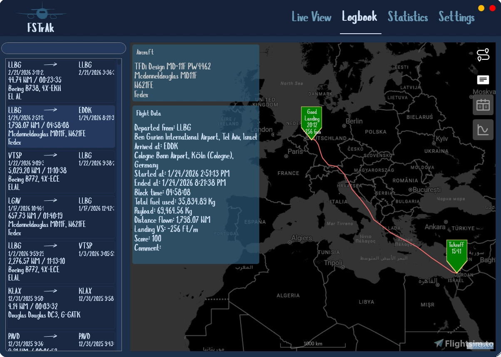
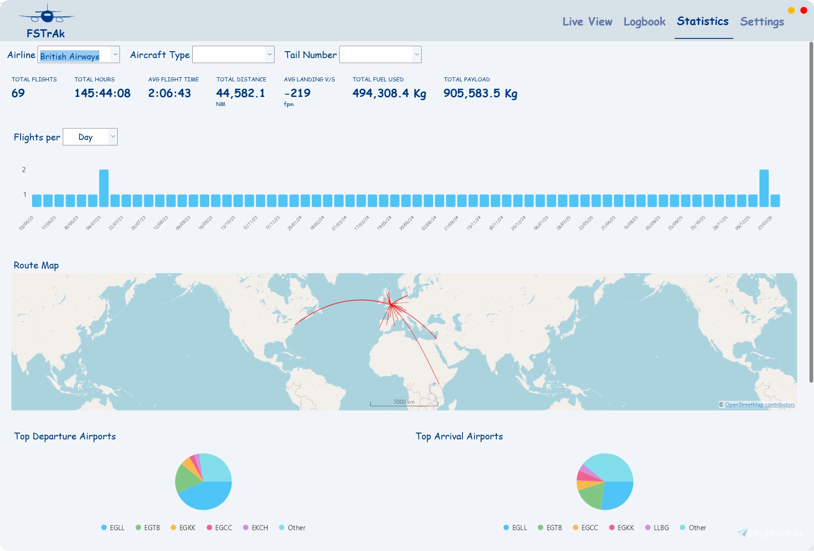

# FSTRaK

FSTrAk is a modern flight tracker and logbook for MSFS (and possibly FSX/P3D, although not tested).
It aims to be a no frills, install and let it run experience - as it requires no manual intervention.
FSTrAk monitors your simulator silently, and will detect when a flight is started, track it on a map, and persist it to a local database when it is complete.

## Features
* Automatic silent start-up.
* Automatic flight tracking (hands-free experience).
* Option (default) to save only complete flights - i.e. flight ended in parking state, with engines off and parking brake set, after having flown.
* Multiple map providers including FAA ArcGIS charts, OpenAIP, Open Flightmaps, OpenTopoMap, Bing, MapTiler, and more.
* Flight analysis and scoring, including landing rate (FPM) and touchdown G force, with protection against bounced landings and post-takeoff settle-backs.
* Editable logbook — correct detected departure/arrival airports, edit aircraft details, and add comments to flights.
* Live flight tracking with a moving map.
* **MSFS in-sim moving map** — MSFS Community addons (a toolbar panel and an MSFS 2024 EFB tablet app) that mirror your FSTrAk map selection, showing chart overlays, live ATC coverage, your flight path, and your aircraft position inside the simulator.
* **VATSIM and IVAO live network support** — view pilots and ATC on the live map.
* Statistics (most used aircraft, most used airlines, average and max payload, distance, etc.)
* Dark mode.

## Installation

### FSTrAk Desktop App

1. Download the latest release zip from [GitHub Releases](https://github.com/o4oren/FSTRaK/releases).
2. Run the FSTrAk installer included in the zip.
3. Launch FSTrAk — it will connect to MSFS automatically when the simulator is running.

### MSFS In-Sim Moving Map Addons (optional)

The zip also contains two MSFS Community addons:

- `fstrak-ingame-panel/` — a moving map **toolbar panel** (MSFS 2020 and 2024).
- `fstrak-efb-app/` — the same moving map as an **EFB app** on the MSFS 2024 tablet home screen.

To enable them:

1. Copy the addon folder(s) into your MSFS **Community** folder:
   - **Microsoft Store / Xbox App:** `%LocalAppData%\Packages\Microsoft.FlightSimulator_8wekyb3d8bbwe\LocalCache\Packages\Community`
   - **Steam:** `%AppData%\Microsoft Flight Simulator\Packages\Community`
2. Restart MSFS.
3. The **FSTrAk Moving Map** icon will appear in the in-sim toolbar (panel) or on the tablet home screen (EFB app).
4. FSTrAk must be running on the same PC for the addons to display map tiles and aircraft position.

---

## API Keys

Some features require optional API keys, configured in the **Settings** view.

### StatSim API Key (VATSIM flight track history)

StatSim provides historical VATSIM flight tracks. When configured, clicking a VATSIM pilot on the live map shows their full flight path since departure instead of a simple geodesic line.

1. Go to [https://statsim.net/about](https://statsim.net/about)
2. Click **Login with VATSIM to get API Key** and authenticate with your VATSIM account
3. Create an API key in your account page
4. Paste the key into **Settings → StatSim API Key**

### IVAO API Key (IVAO flight track history & enriched details)

The IVAO API key enables full flight track history for IVAO pilots, plus enriched details for pilots and ATC (controller name, rating, ATIS, route, remarks) when clicking on them in the live map.

1. Go to [https://developer.ivao.aero](https://developer.ivao.aero) and log in with your IVAO account
2. Create a new application to obtain an API key
3. Paste the key into **Settings → IVAO API Key**

Without an API key, IVAO pilots show a geodesic line from departure to their current position, and ATC details are limited to what the public feed provides.

### Other API Keys

| Key | Feature | Where to get it |
|-----|---------|----------------|
| MapTiler | MapTiler map tiles | [https://cloud.maptiler.com](https://cloud.maptiler.com) — free tier available |
| OpenAIP | Aviation chart overlay | [https://www.openaip.net](https://www.openaip.net) — free registration |
| Azure Maps | Azure Maps tile layers | [https://portal.azure.com](https://portal.azure.com) — free tier available |

---

## Roadmap
- [ ] Simbrief integration (fetch passengers, planned vs actual fuel and time, planned vs actual route).
- [ ] More statistics.
- [ ] Display bearing/distance to a designated point on the map.
- [x] VATSIM integration (display live traffic and ATC on the map).
- [x] IVAO integration (display live traffic and ATC on the map).
- [x] MSFS 2024 in-sim moving map tablet panel.

#### Flight Analysis

#### Live Tracking, with OpenTopoMaps

#### Scoring events in flight analysis, with Bing Hybrid map

#### Live map with VATSIM ATC coverage

#### MSFS in-sim moving map tablet panel

